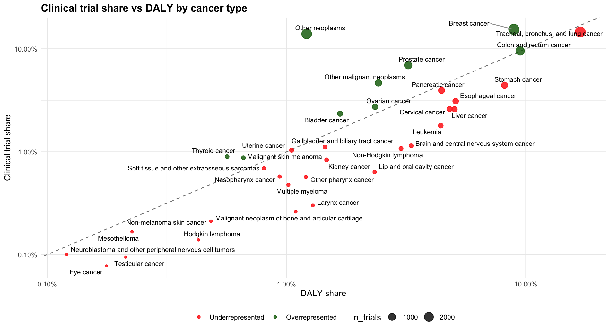

## Overview

Our focus for this final project is centered around looking into how the global burden of disease is being addressed by clinical trials around the world. With cancer being a worldwide health issue, the estimated number of cancer cases worldwide is expected to grow to around 35 million by 2050. With such a high number, it is paramount to human health that cancer research continues to discover treatments for all types.

Our research question is: **How does clinical research around the world address known disease burdens?** In other words, how do the number and type of clinical trials align with current needs for treatments among diseases that affect many people?

## Data sources

1. **Global Burden of Disease Study (GBD)**
2. **ClinicalTrials.gov**
   - Used an LLM (OpenAI-4.0-mini) to standardize trial types based on study titles.
3. **WHO International Clinical Trials Registry Platform (ICTRP)**

## Output

Example:

```{r, echo=FALSE}

```

## Team collaborators

- Khaleesi (Macalester College ’25)
- Scarlett (Macalester College ’26)


