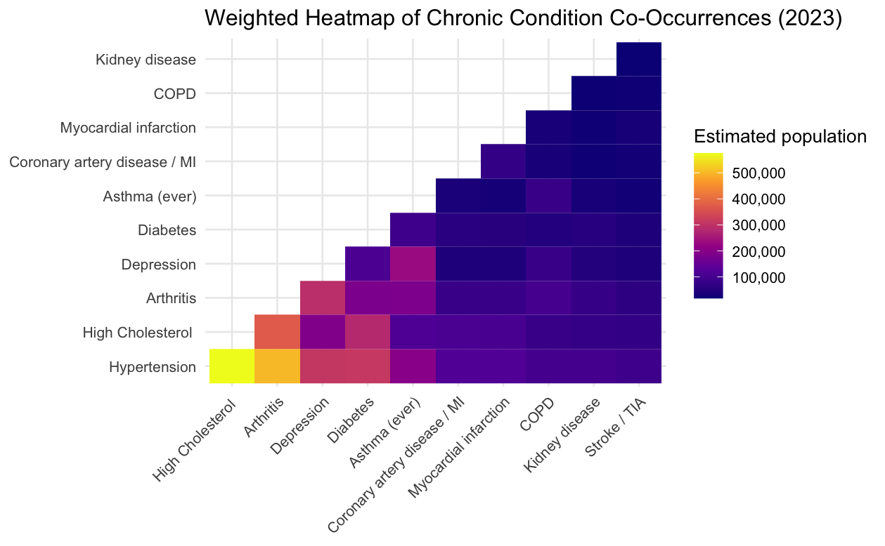

## Overview

In collaboration with the **Minnesota Department of Health (MDH)** and Prof. Heggesth’s STAT 202 course, this project investigates relationships between **social determinants of health (SDOH)** and **chronic conditions** among adults in Minnesota. Using data from the **Behavioral Risk Factor Surveillance System (BRFSS)**, we applied survey-weighted methods to produce population-representative estimates and compare outcomes across demographic and socioeconomic groups.

The goal of the analysis is to highlight which SDOH factors (e.g., income, education, access to care, and related measures) are most strongly associated with chronic condition prevalence, and to translate these results into clear, stakeholder-friendly visuals and summaries. 

## Data
- BRFSS (Minnesota), survey-weighted

## Outputs
- Summary tables and figures
- Reproducible analysis pipeline

Example:

```{r, echo=FALSE}

```


## Team collaborators 
- Jonah (Macalester 27')
- Elliot (Macalester 27')
- Tu (Macalester 26')
- Gabriela (Macalester 26')
- Adrian (Macalester 26')